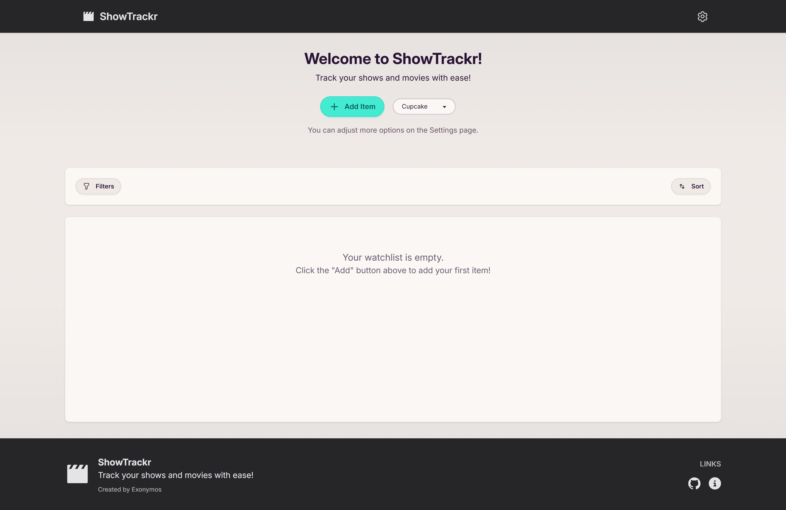

# ShowTrackr

**Track your shows and movies with ease!**

 

 

ShowTrackr is a simple, personal, locally-run web application designed to help you keep track of movies and TV shows you want to watch or have already watched. It focuses on manual entry, giving you full control over your watchlist data without relying on external services. Built with Python (Flask), HTMX, Tailwind CSS, and DaisyUI.

## Table of Contents

- [ShowTrackr](#showtrackr)
  - [Table of Contents](#table-of-contents)
  - [Overview](#overview)
  - [Key Features](#key-features)
  - [Previews](#previews)
  - [Getting Started](#getting-started)
    - [Quick Start](#quick-start)
  - [Detailed Documentation](#detailed-documentation)
  - [Contributing](#contributing)
  - [License](#license)
  - [Acknowledgements](#acknowledgements)

## Overview

ShowTrackr provides a private, free, and straightforward way to manage your media watchlist directly on your own computer. No cloud accounts, no data collection, just your list, your way.

It uses a modern web stack (Python/Flask backend, HTMX for dynamic frontend updates without full page reloads) and is styled with Tailwind CSS and DaisyUI for a clean, responsive, and themeable interface. All your data is stored locally in a simple SQLite database file, ensuring privacy and portability.

(<a href="#showtrackr">back to top</a>)

## Key Features

- **Manual Entry & Management:** Add, edit, and delete movies and TV shows with comprehensive details (Title, Type, Year, Status, Rating, Dates, External IDs, Notes, Poster URL).
- **Dynamic Watchlist View:** Browse your collection with an intuitive list view that includes:
  - Date grouping (Month/Day, prioritizing "Date Watched").
  - Poster image display with hover-preview tooltips.
  - Visually appealing star-based ratings.
  - Quick links to IMDb, TMDb, and Letterboxd using provided IDs.
- **Powerful Filtering:** Narrow down your list by Status, Type, Release Year(s), and Rating Range.
- **Flexible Sorting:** Order your items by Date Watched/Added, Title (case-insensitive), Release Year, or Rating, with Asc/Desc toggle and nulls-last logic.
- **Interactive UI:**
  - Smooth pagination with configurable items per page and direct page input.
  - HTMX-powered updates for a seamless experience without full page reloads.
  - OOB (Out-of-Band) swaps for dynamic updates to control elements.
- **Personalization & Utility:**
  - Extensive theme selection powered by DaisyUI, changeable on the fly.
  - Local data storage (`database.db`) for privacy and control.
  - Data Import/Export functionality (JSON format).
  - Search watchlist items by title (Ctrl+K shortcut).
  - Feedback submission form.
- **User-Friendly:** Designed for ease of use, even for non-developers, after initial setup. Includes unsaved changes warnings and informative toast notifications.

➡️ **For a full list and details, see the [Features Guide](./docs/features.md)**

(<a href="#showtrackr">back to top</a>)

## Previews

_Main watchlist view with the Cupcake theme._

More previews showcasing different themes and features are available in the [Previews folder](./previews/).

(<a href="#showtrackr">back to top</a>)

## Getting Started

### Quick Start

1. **Download or Clone the Repository**

2. **Run the Setup Script:**

   - **Windows:** Double-click `setup.bat` or run `setup.bat` in Command Prompt.
   - **Linux/macOS:** Run `./setup.sh` in your terminal (you may need to `chmod +x setup.sh` first).

3. **Follow the prompts.** The setup will:

   - Check for Python 3.10+, pip, and venv (and help you install them if missing)
   - Install the `rich` library for beautiful output
   - Install all Python and Node dependencies
   - Set up the database and configuration

4. **Activate the virtual environment:**

   - **Windows:** `.\.venv\Scripts\activate`
   - **Linux/macOS:** `source .venv/bin/activate`

5. **Run the application:**
   - **Windows:** `run.bat`
   - **Linux/macOS:** `./run.sh`

If you encounter errors, see the [Setup Guide](./docs/setup.md) for troubleshooting and manual steps.

(<a href="#showtrackr">back to top</a>)

## Detailed Documentation

For comprehensive information, please refer to the documentation in the `docs/` folder:

- **[🏠 Main Documentation Page](./docs/index.md)**
- **[⚙️ Detailed Setup Guide](./docs/setup.md)**
- **[🚀 Running the Application](./docs/running.md)**
- **[✨ Features Overview](./docs/features.md)**
- **[📜 Changelog](./docs/changelog.md)**
- **[🤝 Contribution Guidelines](./CONTRIBUTING.md)** (Also in root)
- **[⚖️ License Information](./LICENSE)** (Also in root)

(<a href="#showtrackr">back to top</a>)

## Contributing

Contributions are highly encouraged and welcome! Whether it's reporting a bug, suggesting a feature, or submitting code changes, your help is appreciated.

Please read our [Contribution Guidelines](./CONTRIBUTING.md) for details on our code of conduct and the process for submitting pull requests. You can also check the [issues page](https://github.com/Exonymos/ShowTrackr-Web/issues) for existing ideas or problems.

(<a href="#showtrackr">back to top</a>)

## License

This project is licensed under the **GNU General Public License v3.0**.

See the [LICENSE](./LICENSE) file for full details.

(<a href="#showtrackr">back to top</a>)

## Acknowledgements

ShowTrackr is built with ❤️ and the help of these fantastic open-source projects:

- [Python](https://www.python.org/) & [Flask](https://flask.palletsprojects.com/)
- [HTMX](https://htmx.org/)
- [SQLite](https://www.sqlite.org/)
- [SQLAlchemy](https://sqlalchemy.org/) & [Flask-SQLAlchemy](https://flask-sqlalchemy.palletsprojects.com/)
- [Alembic](https://alembic.sqlalchemy.org/) & [Flask-Migrate](https://flask-migrate.readthedocs.io/)
- [Tailwind CSS](https://tailwindcss.com/) & [DaisyUI](https://daisyui.com/)
- [Simple Icons](https://simpleicons.org/)

(<a href="#showtrackr">back to top</a>)

