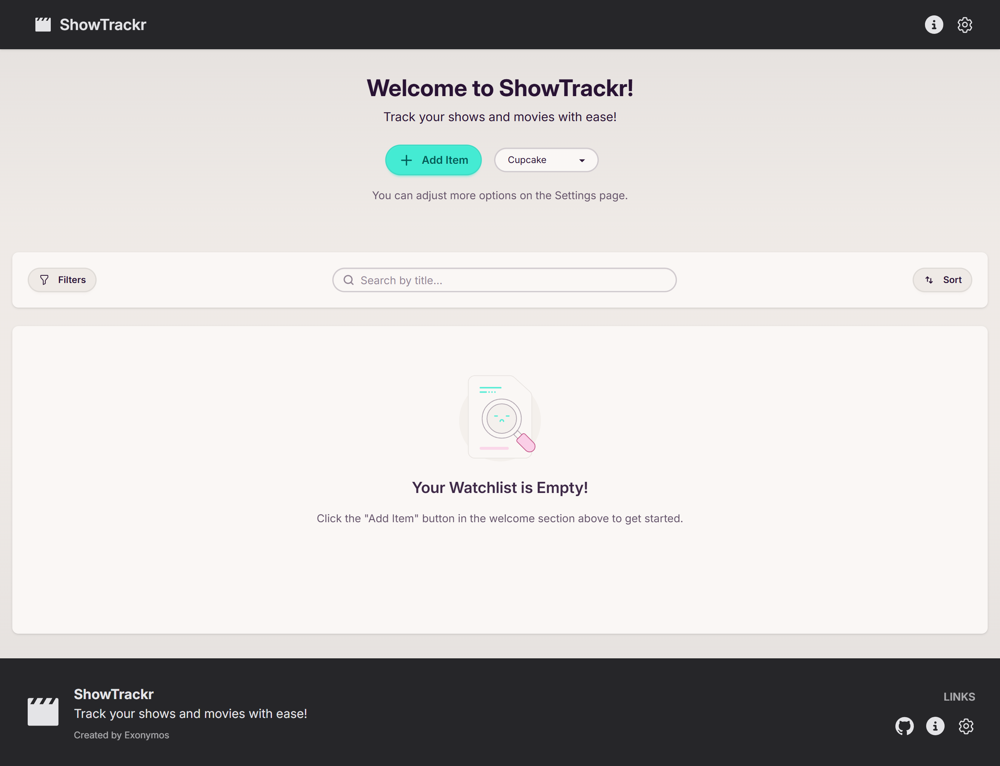
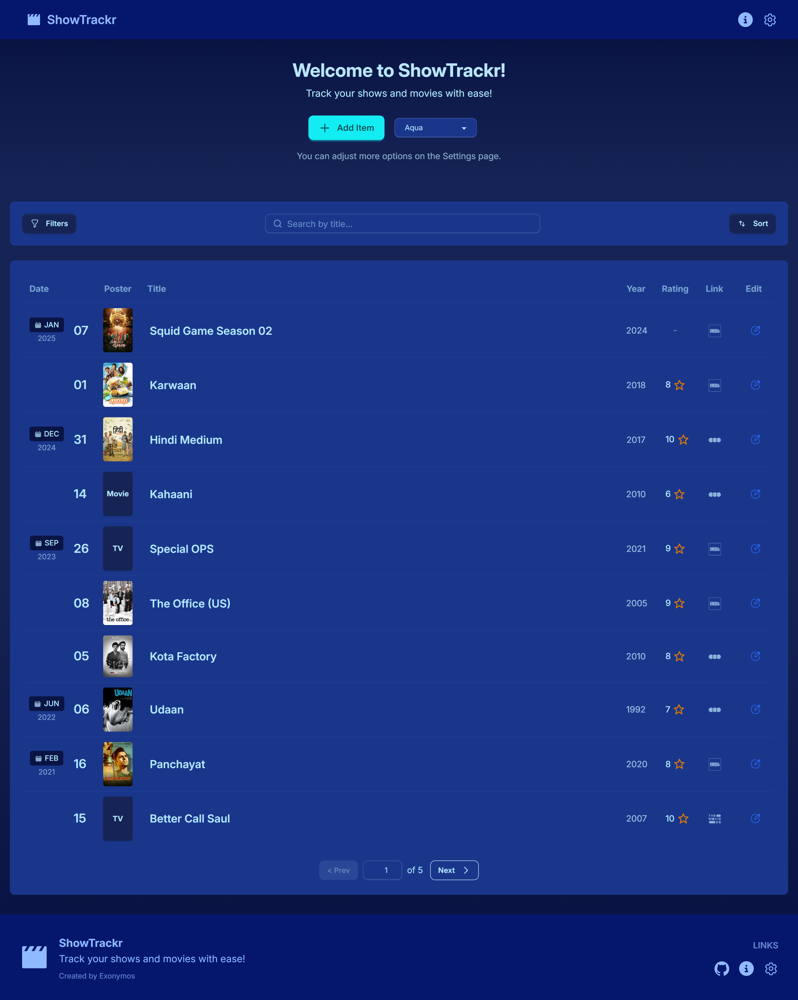
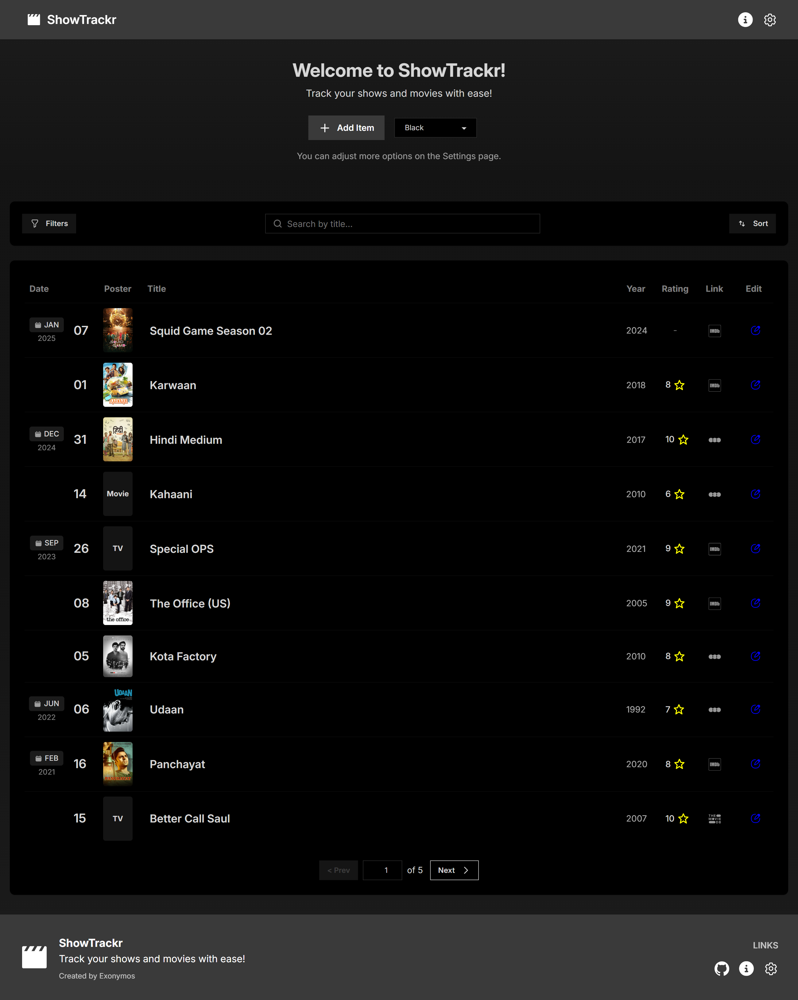

# ShowTrackr Web – Quick Visual Preview

## Table of Contents

- [🏠 Home Page](#-home-page)
- [🚫 Error Pages](#-error-pages)
- [➕ Add Item Form](#-add-item-form)
- [ℹ️ About Page](#ℹ%EF%B8%8F-about-page)
- [⚙️ Settings Page](#%EF%B8%8F-settings-page)
- [🎨 Themes Preview](#-themes-preview)

## 🏠 Home Page

|                       Main                        |                                       Empty List                                       |
| :-----------------------------------------------: | :------------------------------------------------------------------------------------: |
|  |  |

(<a href="#top">back to top</a>)

---

## 🚫 Error Pages

|                     404 Not Found                     |               500 Internal Server Error               |
| :---------------------------------------------------: | :---------------------------------------------------: |
|  |  |

(<a href="#top">back to top</a>)

---

## ➕ Add Item Form

(<a href="#top">back to top</a>)

---

## ℹ️ About Page

|                 About Tab                 |                          Changelog Tab                           |                            Feedback Tab                            |
| :---------------------------------------: | :--------------------------------------------------------------: | :----------------------------------------------------------------: |
|  |  |  |

(<a href="#top">back to top</a>)

---

## ⚙️ Settings Page

|                                   Styling Tab                                    |                                    Database Tab                                     |
| :------------------------------------------------------------------------------: | :---------------------------------------------------------------------------------: |
|  |  |

(<a href="#top">back to top</a>)

---

## 🎨 Themes Preview

<table>
  <tr>
    <td align="center"> <b>Acid</b></td>
    <td align="center"> <b>Autumn</b></td>
  </tr>
  <tr>
    <td align="center"> <b>Bumblebee</b></td>
    <td align="center"> <b>Caramellatte</b></td>
  </tr>
  <tr>
    <td align="center"> <b>Corporate</b></td>
    <td align="center"> <b>Cupcake</b></td>
  </tr>
  <tr>
    <td align="center"> <b>Lemonade</b></td>
    <td align="center"> <b>Light</b></td>
  </tr>
  <tr>
    <td align="center"> <b>Lofi</b></td>
    <td align="center"> <b>Nord</b></td>
  </tr>
  <tr>
    <td align="center"> <b>Pastel</b></td>
    <td align="center"> <b>Retro</b></td>
  </tr>
  <tr>
    <td align="center"> <b>Silk</b></td>
    <td align="center"> <b>Valentine</b></td>
  </tr>
  <tr>
    <td align="center"> <b>Winter</b></td>
    <td align="center"> <b>Abyss</b></td>
  </tr>
  <tr>
    <td align="center"> <b>Aqua</b></td>
    <td align="center"> <b>Black</b></td>
  </tr>
  <tr>
    <td align="center"> <b>Business</b></td>
    <td align="center"> <b>Coffee</b></td>
  </tr>
  <tr>
    <td align="center"> <b>Dark</b></td>
    <td align="center"> <b>Dim</b></td>
  </tr>
  <tr>
    <td align="center"> <b>Dracula</b></td>
    <td align="center"> <b>Ember</b></td>
  </tr>
  <tr>
    <td align="center"> <b>Forest</b></td>
    <td align="center"> <b>Halloween</b></td>
  </tr>
  <tr>
    <td align="center"> <b>Luxury</b></td>
    <td align="center"> <b>Night</b></td>
  </tr>
  <tr>
    <td align="center"> <b>Sunset</b></td>
    <td align="center"> <b>Synthwave</b></td>
  </tr>
</table>

(<a href="#top">back to top</a>)

